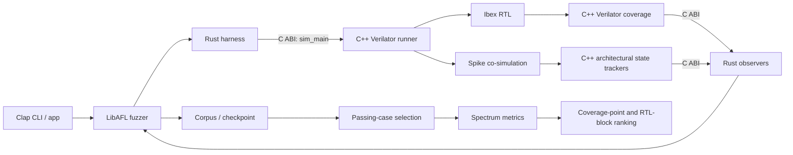

# 第 1 章：总体架构与执行流程

## 1.1 设计目标

本项目针对“已知某个 ELF 能触发 DUT/参考模型差分失败”的场景。核心目标不是寻找
任意 crash，而是围绕这个失败程序生成行为相近但能够通过差分检查的程序，以构造
SBFL 所需的失败/通过频谱。

当前实现把以下职责组合在同一个最终进程中：

- Verilator 执行 Ibex RTL；
- Spike 作为参考模型进行 co-simulation；
- C++ 侧收集 Verilator coverage 和 Spike 体系结构状态；
- Rust/LibAFL 负责输入变异、corpus、调度和 checkpoint；
- Rust 分析层选择通过用例、计算可疑度并映射 RTL block。

## 1.2 组件关系



主要组件如下：

| 组件 | 职责 |
| --- | --- |
| `libcpusbfl.so` | Rust `cdylib`，包含 CLI 入口、LibAFL 和分析代码 |
| `Vibex_simple_system` | 最终可执行程序，链接 Rust 动态库和 Verilator 模型 |
| `simple_system_sbfl.cc` | 提供 `sim_main`，每次输入执行时重置仿真上下文和统计对象 |
| `cosim_stats.cc` | 向 Rust 暴露 coverage/state C ABI |
| `coverage.cc` | 解析 Verilator coverage 文件并按 group 提供计数器 |
| `state_tracker.cc` | 保存 Spike 的 PC、整数寄存器和 CSR 序列 |
| `harness.rs` | 把 `BytesInput` 写入临时 ELF 并调用 `sim_main` |
| `fuzzer.rs` | 创建 observer、feedback、executor、corpus 和 fuzz loop |
| `selection.rs` / `spectrum/` | 选择通过用例并计算 SBFL 分数 |

## 1.3 构建和链接

`Cargo.toml` 将 crate 类型设置为 `cdylib`。FuseSoC core
`ibex_simple_system_sbfl.core` 在链接阶段添加：

```text
-LDFLAGS "$IBEX_HOME/target/release/libcpusbfl.so"
```

依赖的 `ibex_sbfl_setup.core` 在 pre-build 阶段执行两个 hook：

1. 通过 `pkg-config` 检查 Spike 的 `riscv-riscv`、`riscv-disasm`、
   `riscv-fdt`；
2. 在 `IBEX_HOME` 执行 `cargo make build-all`，生成 release 动态库。

Rust 导出的 `main` 符号成为最终模拟器的命令入口；C++ 则向 Rust 提供 `sim_main`
和统计接口。因此只构建 Rust crate 可以得到动态库，但不能得到一个可独立工作的
SBFL executable。

## 1.4 进程启动

`app::run` 完成以下步骤：

1. 从 `RUST_LOG` 初始化 `env_logger`，缺省级别为 `info`；
2. 使用 Clap 解析根参数和子命令；
3. 根据 `workload`、`generation`、`analysis` 分派到对应模块；
4. 初始化 coverage/state 全局对象和仿真器参数；
5. 执行仿真或载入 checkpoint。

Coverage、state tracker 和 simulator arguments 使用 `OnceLock<Mutex<_>>`。这意味着
它们是进程级单例，设计前提是一次进程只执行一套 coverage/state 配置。

## 1.5 单次仿真

`harness::fuzz_harness` 的单次执行顺序是：

1. 把 LibAFL `BytesInput` 写入临时 ELF；
2. 构造模拟器参数 `emu -E <temp-elf> ...`；
3. 调用 C++ `sim_main(argc, argv)`；
4. C++ 重置 Verilator controller 和 `CosimStats`；
5. Ibex 与 Spike 执行差分检查；
6. C++ coverage extension 在 `PostExec` 中导出并解析 Verilator coverage；
7. Spike 每推进一个相关状态点时更新 state tracker；
8. Rust 通过 FFI 拉取 coverage 和 state；
9. `sim_main == 0` 映射为 `ExitKind::Ok`，非零映射为 `ExitKind::Crash`。

这里的 `Crash` 表示仿真器返回非零，通常是差分失败，不等同于操作系统信号意义上的
进程崩溃。

## 1.6 Generation 流程

新 generation session 的状态机如下：

1. 从 `--input` 读取 ELF；目录输入时选择按路径排序后的第一个普通文件；
2. 可选执行 `--reduce-insts`；
3. 运行初始 ELF，要求其结果为 `Crash` 且能被 feedback 接受进主 corpus；
4. 从初始失败 trace 构建 mode-specific mutator；
5. 迭代执行“调度 parent → 变异 ELF → 仿真 → observer → feedback → corpus”；
6. 可按间隔和结束时保存 checkpoint；
7. 除非指定 `--gen-only`，继续选择通过用例并执行 SBFL。

恢复 session 时不再执行初始输入预处理，而是从 checkpoint 重建 `FuzzSession`。
WitHW scheduler 使用保存的 `initial_corpus_id` 恢复初始失败 seed，动态 mutation
priority 则通过 LibAFL state metadata 恢复。

## 1.7 Analysis 流程

`analysis` 不再生成新输入：

1. 读取并校验 checkpoint；
2. 恢复所有 testcase 及其 metadata；
3. 过滤通过用例；
4. 根据 coverage/state 距离执行 selection；
5. 形成一个失败用例加若干通过用例的频谱；
6. 对每种 coverage 的每个 point 统计 `ef/ep/nf/np`；
7. 计算并排序 SBFL 分数；
8. 如果提供完整 RTL 参数，将 coverage point 映射到层次化 RTL block。

普通离线分析主要使用 checkpoint 中保存的数据；启用 `--reduce-cover` 时会重新运行
部分修改后的 ELF，因此仍依赖可工作的仿真器和相同的运行参数。

## 1.8 线程和隔离假设

- LibAFL 使用 in-process executor；仿真发生在当前进程，而不是 fork server。
- 全局 coverage/state 对象由 mutex 保护，但当前流程按单线程执行一次仿真。
- 一个进程内不支持重新初始化为另一套 coverage/state 名称。
- 批量 bugset 脚本通过多个独立工作目录和独立进程实现并行，而不是在一个 SBFL
  进程中并行多个 case。
