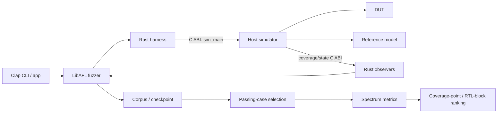

# 第 1 章：总体架构与执行流程

## 1.1 设计目标

本项目面向“已有一个 ELF 能暴露 DUT/参考模型差异”的场景。它围绕该失败输入生成行为
相近但能够通过比较的程序，以构造 SBFL 所需的失败/通过频谱。

项目本身负责：

- LibAFL 输入变异、corpus、feedback、调度和 checkpoint；
- coverage/state observer；
- 通过用例选择和距离计算；
- SBFL 可疑度计算；
- ELF/覆盖率约简和 RTL block 映射；
- 调用宿主仿真器并读取宿主提供的数据。

具体 DUT、参考模型、仿真器构建方式和实验编排由宿主集成负责。

## 1.2 组件关系

| 组件 | 职责 |
| --- | --- |
| `libcpusbfl.so` | `cdylib`，包含 CLI、LibAFL 和分析实现 |
| 宿主 executable | 链接动态库并提供仿真器与 C ABI |
| `harness.rs` | 将 `BytesInput` 写入临时 ELF 并调用 `sim_main` |
| `observer/` | 在每次运行后读取 coverage/state |
| `fuzzer.rs` | 构造 executor、feedback、corpus 和 fuzz loop |
| `selection.rs` | 过滤并选择通过用例 |
| `spectrum/` | 构造频谱并计算可疑度 |
| `block/` | 将覆盖点映射到 SystemVerilog block |

## 1.3 构建和链接边界

`Cargo.toml` 将 crate 类型设置为 `cdylib`。`cargo build --release` 只生成
`libcpusbfl.so`；宿主需要在自己的构建系统中链接该动态库，并实现
[第 3 章](03-data-and-ffi.md)列出的符号。

Rust 导出的 `main` 符号作为链接后 executable 的命令入口。反方向上，宿主向 Rust
提供 `sim_main` 以及 coverage/state 访问函数。因此：

- 本项目可以独立完成 Rust 静态检查和动态库构建；
- 完整执行验证必须由某个宿主集成提供仿真器；
- 宿主专属工具链和构建参数不应写入本项目文档。

## 1.4 进程启动

`app::run` 的主要步骤为：

1. 初始化日志；
2. 使用 Clap 解析根参数和子命令；
3. 分派到 `workload`、`generation` 或 `analysis`；
4. 初始化 coverage/state 全局对象和宿主参数；
5. 执行仿真或加载 checkpoint。

Coverage、state tracker 和 host arguments 使用进程级单例。一次进程应只使用一套
coverage/state 配置。

## 1.5 单次执行

`harness::fuzz_harness` 的执行顺序为：

1. 将 `BytesInput` 写入临时 ELF；
2. 构造 `emu -E <temporary-elf> <host-arguments...>`；
3. 调用宿主 `sim_main(argc, argv)`；
4. 宿主重置上一次运行的仿真和统计状态；
5. 宿主运行 DUT/参考模型比较；
6. Rust 通过 C ABI 拉取 coverage 和 state；
7. `sim_main == 0` 映射为 `ExitKind::Ok`，非零映射为 `ExitKind::Crash`。

这里的 `Crash` 表示宿主返回非零，通常代表比较失败，不一定是操作系统信号意义上的
进程崩溃。

## 1.6 Generation 流程

新 session 的状态机为：

1. 从 `--input` 加载 ELF；目录输入选择路径排序后的第一个普通文件；
2. 可选执行输入约简；
3. 运行初始 ELF，要求其失败且被 feedback 接收进主 corpus；
4. 根据初始失败轨迹构建 mode-specific mutator；
5. 重复“调度 parent → mutation → 宿主执行 → observer → feedback → corpus”；
6. 按间隔和结束点保存 checkpoint；
7. 除非使用 `--gen-only`，继续执行 selection 和 SBFL。

恢复 session 时从 checkpoint 重建 `FuzzSession`，不再执行初始输入预处理。

## 1.7 Analysis 流程

`analysis` 不生成新输入：

1. 加载并校验 checkpoint；
2. 恢复 testcase 及 metadata；
3. 过滤通过用例；
4. 计算 coverage/state 距离并执行 selection；
5. 形成失败/通过频谱；
6. 统计各覆盖点的 `ef/ep/nf/np`；
7. 计算并排序 SBFL 分数；
8. 可选地将覆盖点映射到 RTL block。

普通离线分析主要使用 checkpoint 数据；启用 `--reduce-cover` 时仍会调用宿主仿真器。

## 1.8 执行模型

- LibAFL 使用 in-process executor；宿主仿真器在当前进程内执行。
- 当前流程按单线程顺序运行单个输入。
- 全局 coverage/state 对象在一个 session 内地址稳定。
- 多实验并行应由宿主在独立进程中编排。
